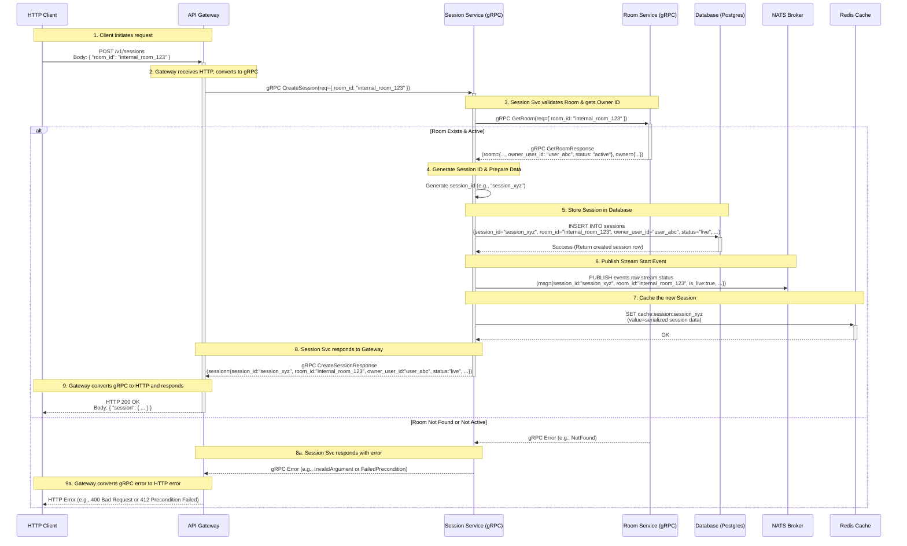

# 创建房间场次 (Session) HTTP 请求流程

**注意:** 下方的流程图使用 Mermaid 语法编写。你需要使用支持 Mermaid 的 Markdown 查看器（例如 VS Code 内置预览或带有 Mermaid 插件的浏览器扩展）才能正确渲染为图形。

## 流程解释

1.  **客户端发起 HTTP 请求**:
    *   客户端向 API Gateway 发送 `POST /v1/sessions` 请求。
    *   请求体包含内部房间 ID: `{ "room_id": "your_internal_room_id" }`。
    *   这个 `room_id` 需要客户端预先获取（例如，通过浏览列表或搜索）。

2.  **API Gateway 处理请求**:
    *   Gateway 接收 HTTP 请求。
    *   使用 `grpc-gateway` 将 HTTP 请求转换为 gRPC `CreateSessionRequest`。
    *   将 gRPC 请求代理给 Session Service。

3.  **Session Service 执行逻辑**:
    *   接收 gRPC 请求。
    *   **验证房间**: 调用 Room Service 的 `GetRoom` 方法，传入 `room_id`，获取房间状态和 `owner_user_id`。如果房间无效或状态不允许，返回错误。
    *   **生成 Session ID**: 创建一个新的 UUID 作为 `session_id`。
    *   **数据库操作**: 将新 Session 信息（包括 `session_id`, `room_id`, `owner_user_id`, `status='live'` 等）存入数据库。
    *   **发布 NATS 事件**: 发布 `events.raw.stream.status` 事件，通知直播开始。
    *   **更新 Redis 缓存**: 将新 Session 数据缓存到 Redis。
    *   **返回 gRPC 响应**: 将包含完整 Session 信息的 `CreateSessionResponse` 返回给 Gateway。

4.  **API Gateway 返回响应**:
    *   接收 gRPC 响应。
    *   将 gRPC 响应转换为 JSON。
    *   向客户端发送 HTTP `200 OK` 响应，响应体为包含新 Session 信息的 JSON 对象。

5.  **客户端接收 HTTP 响应**: 客户端收到成功响应和新创建的 Session 数据。